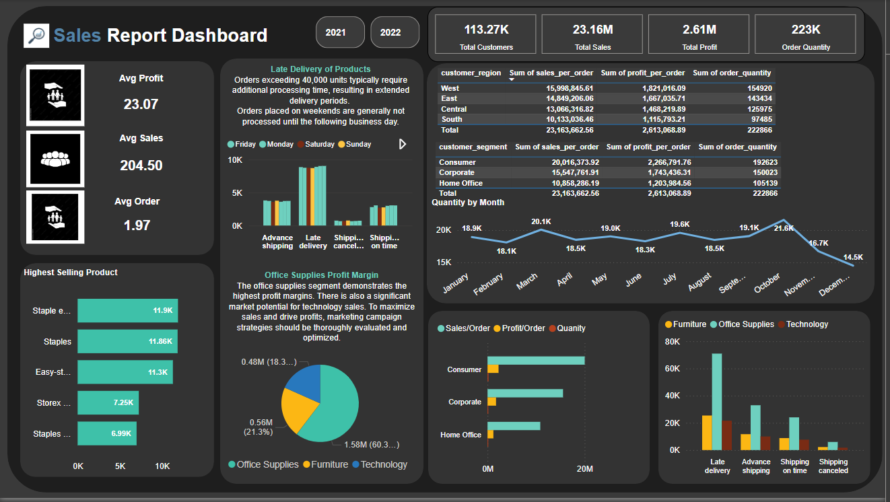

# Sales-Executive-Report 

## Introduction: Improving Sales and Profit Margins in the eCommerce Sector

## Context:
Our eCommerce platform provides a wide range of products across various categories. The dataset includes details on customer demographics, product categories, sales figures, order quantities, shipping details, and profit margins. Understanding patterns and trends within this data can help optimize business operations and enhance profitability.

## Problem Statement:
The primary challenge is to identify key factors influencing sales and profit margins across different product categories and customer segments. Additionally, optimizing shipping strategies to reduce costs and improve delivery times is crucial for customer satisfaction and operational efficiency.

Objectives:
1. Sales Analysis: Identify the top-selling product categories and understand the underlying factors driving high sales volumes.
2. Profit Margin Analysis: Determine which product categories and customer segments generate the highest profit margins and analyze the factors contributing to these margins.
3. Shipping Optimization: Analyze shipping times and costs to recommend strategies for improving delivery efficiency while reducing expenses.

Key Questions:
1. Which product categories are the most and least profitable?
2. What are the primary factors contributing to delayed shipments, and how can they be mitigated?
3. Which customer segments should be targeted for marketing campaigns to maximize sales and profitability?

## Chart 1
The Chart below is a dashboard representation of the data set, Highlighting key factors.

# Executive Summary:

The analysis of the dataset revealed critical insights into the performance of different product categories and their delivery timelines. 
## Product Category Performance:
Office Supplies emerged as the leading category, with a total order quantity of 133,884 units. This category significantly outperformed Furniture and Technology, which recorded 48,053 and 40,929 units, respectively. 
In terms of average order quantities, Office Supplies also led with an average of 33,471 units per order. Furniture and Technology followed with averages of 12,013.25 and 10,232.25 units per order, respectively.
## Delivery Performance:
The primary factor contributing to delayed shipments is identified in the Office Supplies category, where late deliveries make up 31.83% of the total order quantity. This suggests potential issues in supply chain and logistics operations specific to this category. To mitigate these delays, a thorough review of the supply chain processes, improved inventory management, and enhanced coordination with logistics partners are recommended.
## Monthly Performance:
October was the peak month for order quantities, with 21,575 units ordered, making it 48.78% higher than December, which had the lowest quantity at 14,501 units. October's performance accounted for 9.68% of the total quantity, indicating a seasonal trend or successful marketing efforts during this period.
## Profit Analysis:
The sum of profit per order across the top five products ranged from $6,990.62 to $11,902.93, showcasing a diverse profit landscape within the product offerings.
There is a positive correlation between sales per order and total profit per order, highlighting the importance of increasing sales volumes to enhance profitability.
## Strategic Recommendations:
Given the substantial profit margins in Office Supplies and the significant market potential for Technology sales, it is imperative to optimize marketing campaigns to boost sales and drive overall profits.
Addressing the delivery delays in the Office Supplies category should be a priority to improve customer satisfaction and operational efficiency. 
Leveraging the positive correlation between sales and profits, strategies to increase order quantities, particularly in high-performing months like October, should be explored.
This analysis provides a foundation for strategic decision-making aimed at maximizing sales, enhancing profit margins, and improving operational efficiencies across all product categories.
Leveraging the positive correlation between sales and profits, strategies to increase order quantities, particularly in high-performing months like October, should be explored.
This analysis provides a foundation for strategic decision-making aimed at maximizing sales, enhancing profit margins, and improving operational efficiencies across all product categories.

